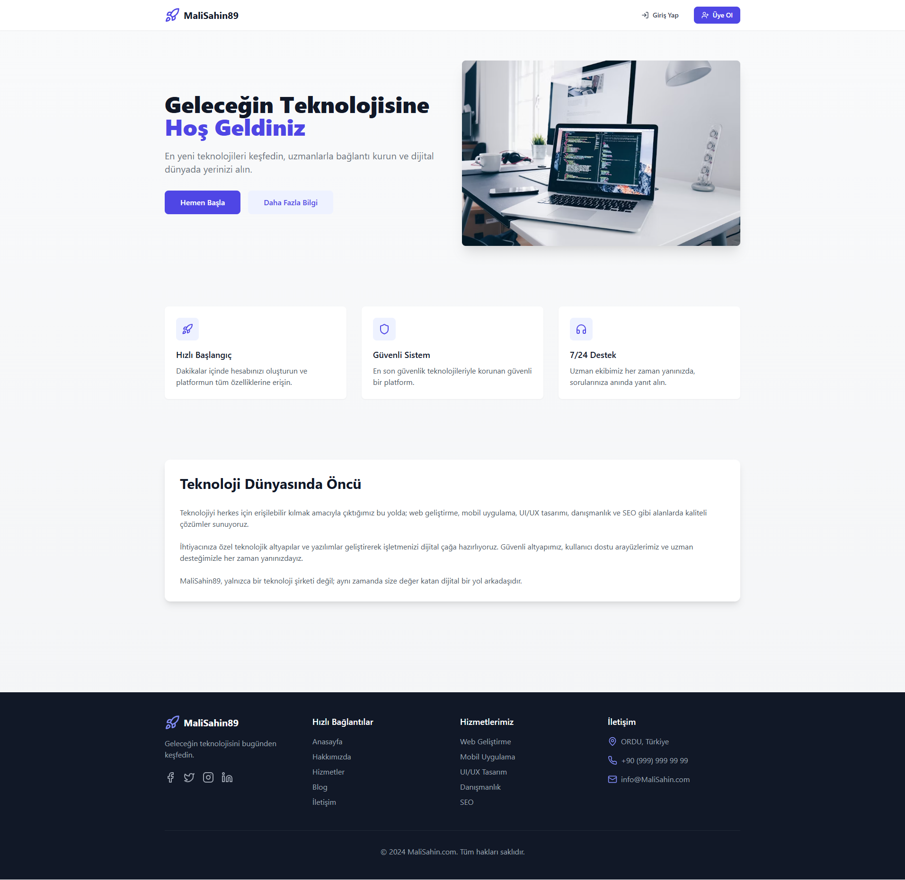
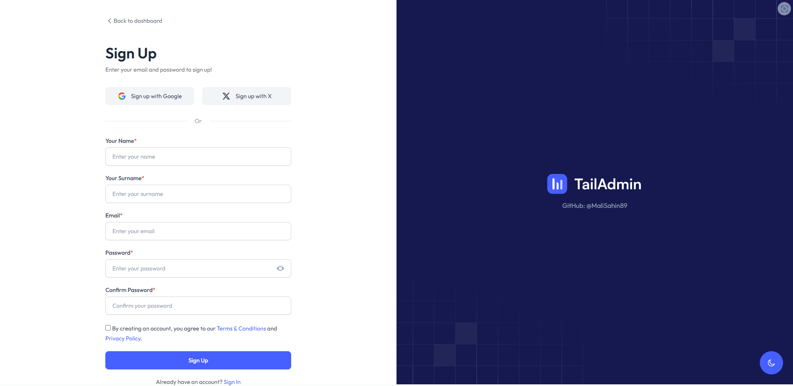
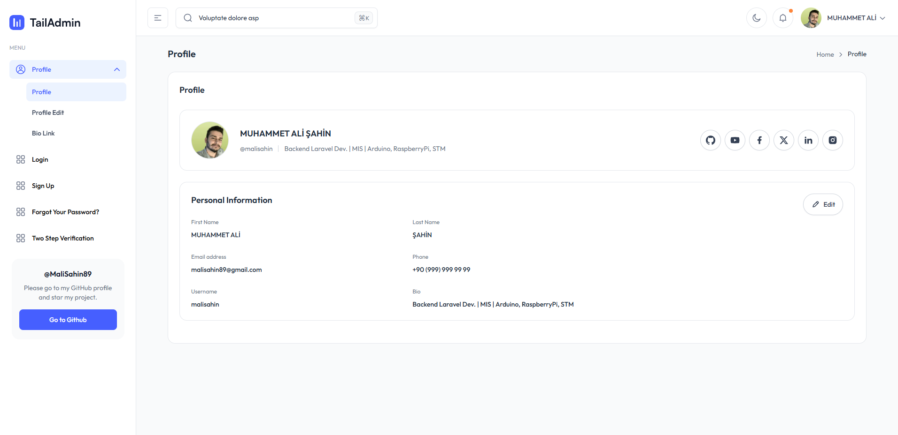
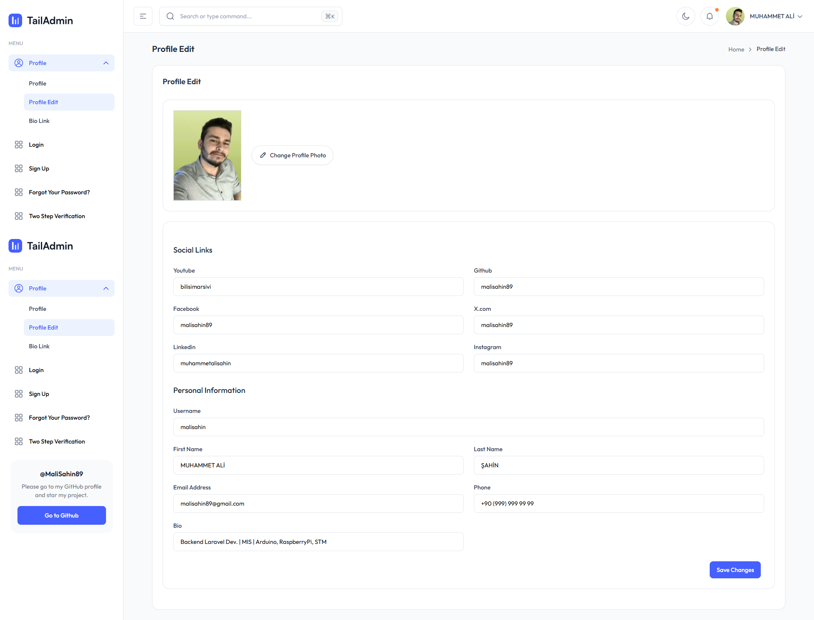
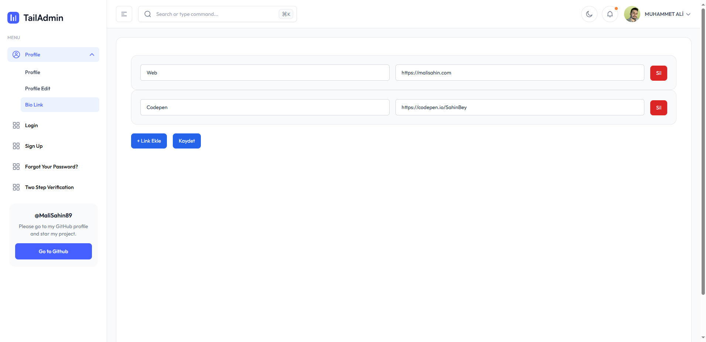
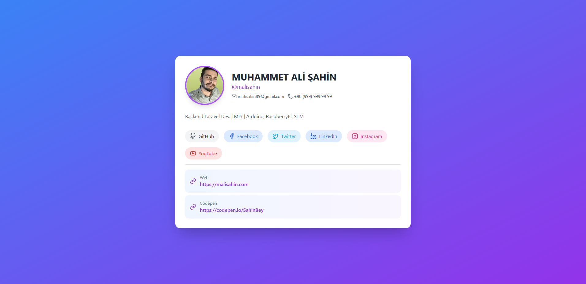

# 🔗 Custom Link Sharing Platform – Laravel 12+ Bootstrap UI Auth + TailAdmin Template

Bu proje, kullanıcıların **kendi seçtikleri kullanıcı adıyla** kayıt olup, kendi bağlantılarını kolayca paylaşabilecekleri bir sistemdir. Laravel 12, TailAdmin UI ve Bootstrap UI Auth kullanılarak geliştirilmiştir.

---
## 🎥 Video Tanıtımı

- 📽️ **Proje Tanıtım Videosu:**  
  [YouTube Video Linki](https://youtu.be/ckWqxEljBxE)

- ⚙️ **Çalışma Anı (Demo):**  
  [YouTube Çalışma Videosu - Belirli Zaman Damgası](https://youtu.be/ckWqxEljBxE?t=164)

---
## 📸 Proje Görselleri

### Ana Sayfa


### Giriş Sayfası


### Üyelik Sayfası


### Kullanıcı Sayfası


### Kullanıcı Edit Sayfası


### Bio Link Sayfası


### Bio Sayfası


---

## 🧩 Özellikler

- ✅ Kullanıcı kaydı ve girişi (Bootstrap UI Auth)
- ✅ Kullanıcı adı seçimiyle özel bağlantı sayfası (örnek: `site.com/@kullaniciadi`)
- ✅ Kişisel bağlantı yönetimi ve paylaşımı
- ✅ TailAdmin arayüzü ile modern ve responsive tasarım
- ✅ Laravel 12 ile güvenli ve ölçeklenebilir yapı

---

## 🚀 Kurulum

Aşağıdaki adımları takip ederek projeyi kendi ortamınızda çalıştırabilirsiniz.

### 1. Projeyi Klonla

```bash
git clone https://github.com/malisahin89/laravel12-bootstrap-ui-auth.git
cd laravel12-bootstrap-ui-auth
```

### 2. Bağımlılıkları Kur

```bash
composer install
```

### 3. Ortam Dosyasını Ayarla

```bash
cp .env.example .env
php artisan key:generate
```

`.env` dosyasında aşağıdaki alanları kendi veritabanı bilgilerine göre doldur:

```
DB_DATABASE=veritabani_adi
DB_USERNAME=kullanici_adi
DB_PASSWORD=sifre
```

### 4. Veritabanını Hazırla

```bash
php artisan migrate
```


### 5. Symlink oluştur

```bash
php artisan storage:link
```

### 6. Geliştirme Sunucusunu Başlat

```bash
php artisan serve
```

Artık projeyi `http://localhost:8000` üzerinden görüntüleyebilirsin.

---

## 🛠️ Kullanılan Teknolojiler

- [Laravel 12](https://laravel.com)
- [TailAdmin](https://tailadmin.com)
- [Bootstrap UI Auth](https://github.com/laravel/ui)
- [MySQL](https://www.mysql.com)

---

## 📄 Lisans

Bu proje açık kaynaklıdır ve [MIT Lisansı](LICENSE) ile lisanslanmıştır.

---

## 💻 Geliştirici

Muhammet Ali ŞAHİN – [LinkedIn Profilim](https://www.linkedin.com/in/muhammetalisahin/)

